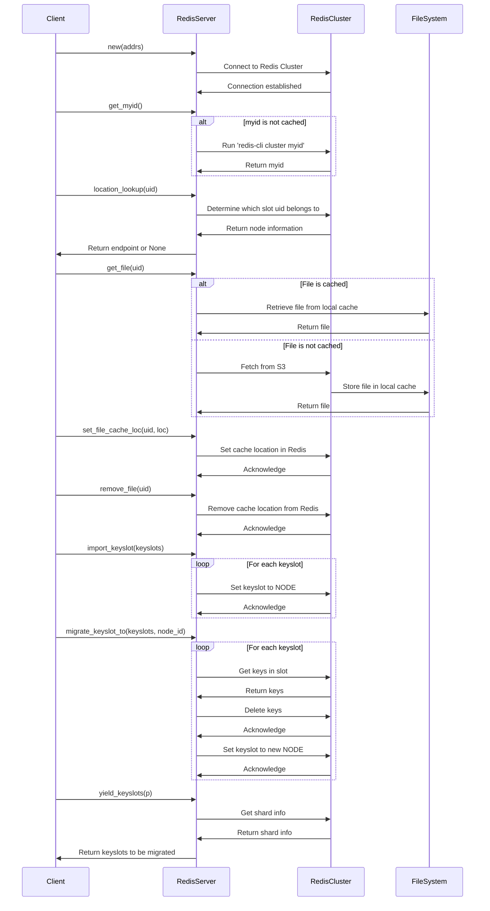
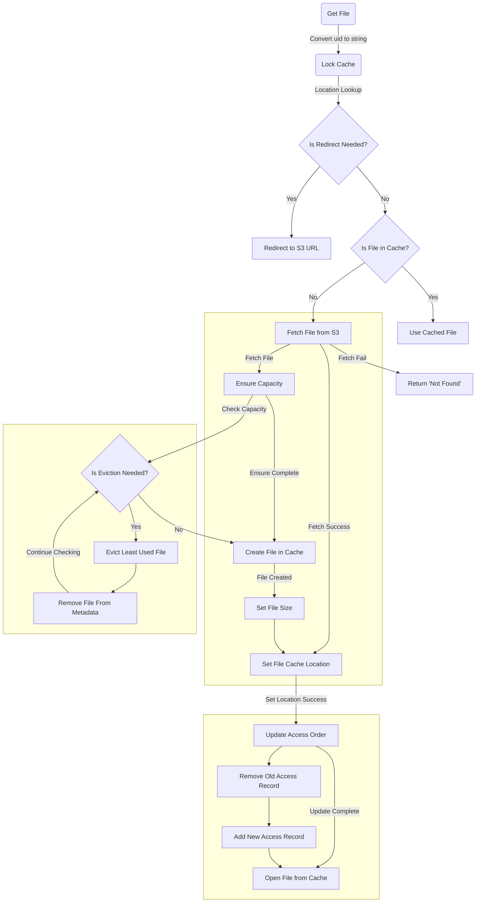
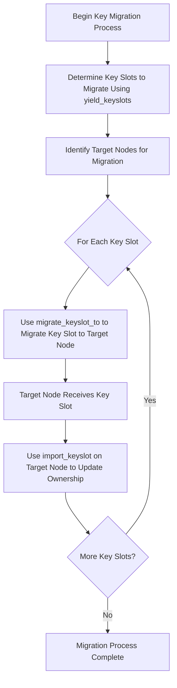

# ISTSIIO

## Server
To run Redis server, use Docker to start a container:
`docker run --name=redis-devel --publish=6379:6379 --hostname=redis --restart=on-failure --detach redis:latest`

## Detailed Design 
### Client-Server Flow

### Dive inside DiskCache

### Metadata Migration
